# UTM Timetable and Space Management System

## End User Documentation

### 1. Introduction

Welcome to the UTM Timetable and Space Management System! This application is designed to streamline, optimize, and modernize the scheduling process at UTM. It replaces the previous system found at web.fc.utm.my/ttms/ with a modern, responsive design that works across various devices and screen sizes.

---

### 2. Getting Started

#### 2.1 Logging In

1. Navigate to the login page.
2. Enter your UTM FK matric number as your ID.
3. Enter your IC number as your password.
4. Click the "Login" button.
5. If your credentials are correct, you'll be redirected to the system. Otherwise, you'll see an error message.

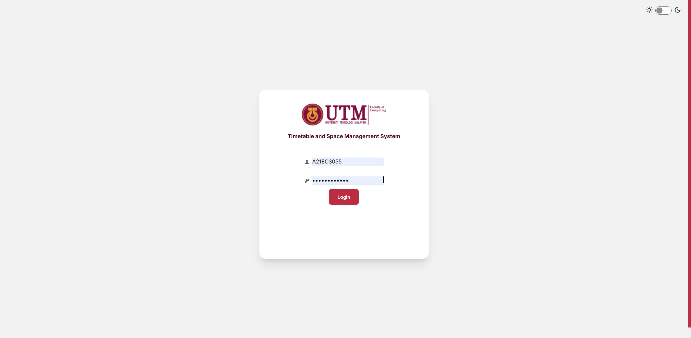

---

### 3. Main Features

#### 3.1 Home Page

- Displays your current user data:
  - Name
  - Matric number
  - Current session and semester details
- Navigate through the system using the sidebar (may be hidden on smaller screens)

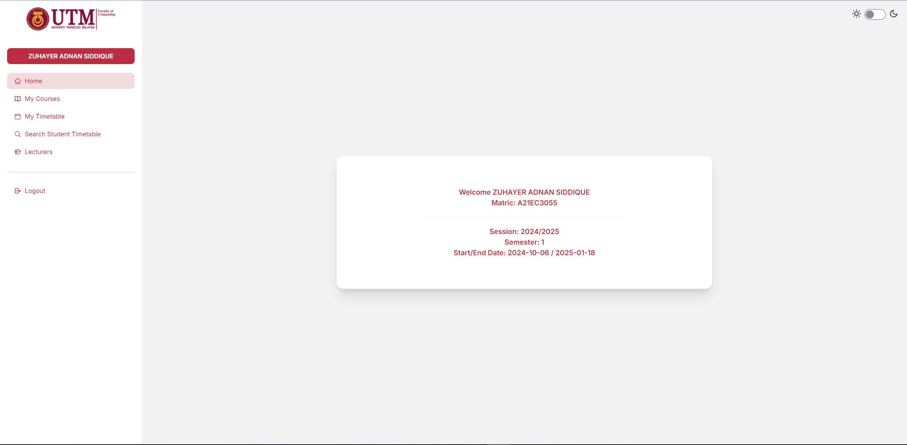

---

#### 3.2 My Courses

- View all courses you've registered for, organized by Year and Semester.
- Use the accordion component to explore different academic periods.
- Click "View Course Table" to see a searchable table of all your courses.

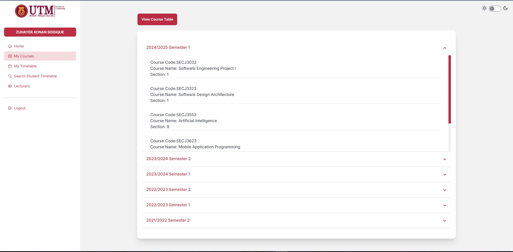

---

#### 3.3 My Timetable

- Displays your current academic session's timetable.
- Shows class times and room numbers for your registered courses.

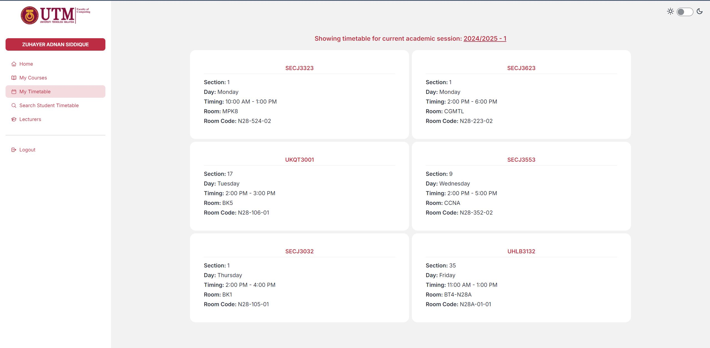

---

#### 3.4 Search Student Timetable

Two options available:

1. **Quick Search**:
   - Enter a student's matric number to view their timetable.
2. **Search By Name**:
   - View a table of all students in the system.
   - Use the search function to find specific students.
   - Click "View Timetable" to generate the selected student's timetable.

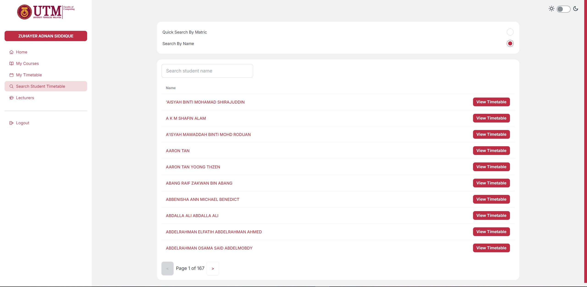

---

#### 3.5 Search Lecturer Timetable

- View a table of all lecturers in the system.
- Use the search function to find specific lecturers.
- Click "View Timetable" to generate the selected lecturer's timetable.

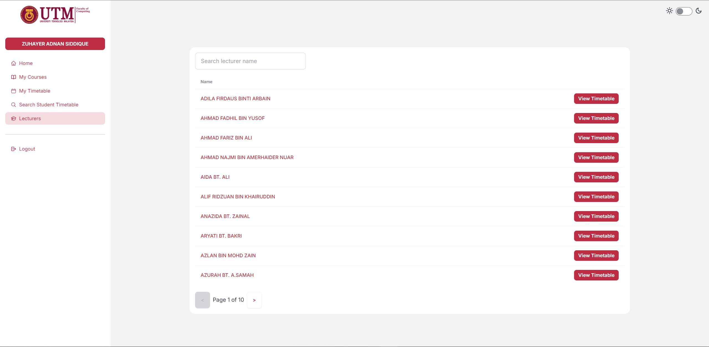

---

### 4. Additional Features

### 4.1 Responsive Design

- The system adapts to various screen sizes and devices.

  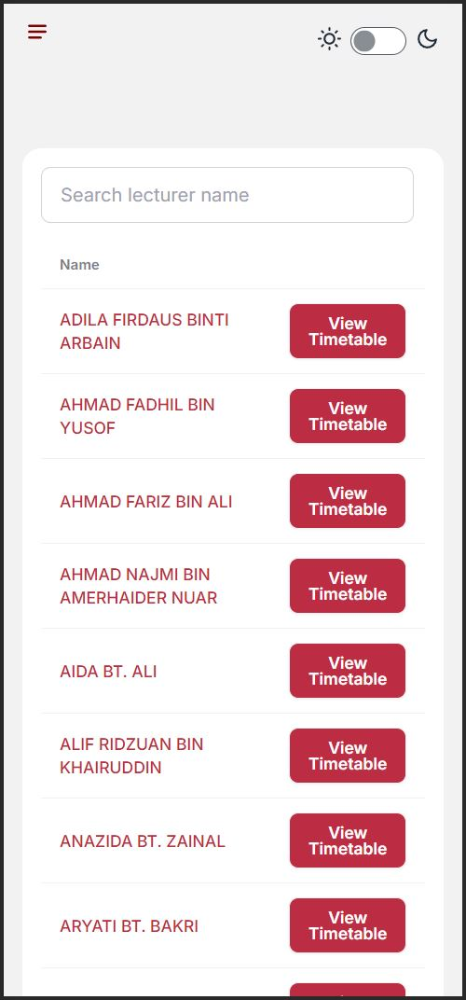
  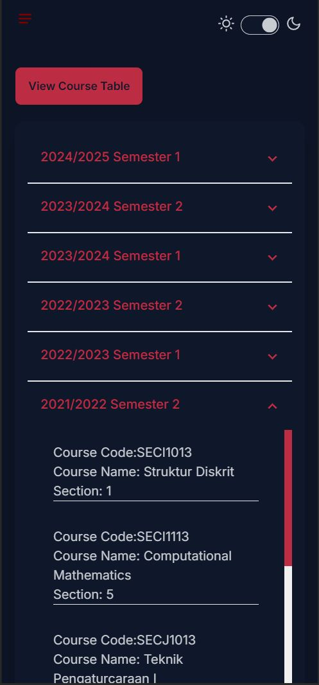
  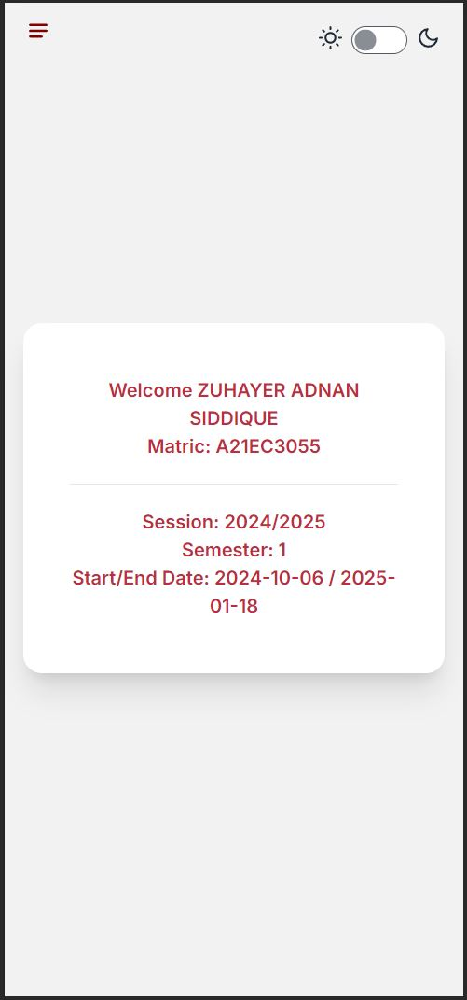

---

#### 4.2 Dark Mode

- Toggle between light and dark modes for comfortable viewing.

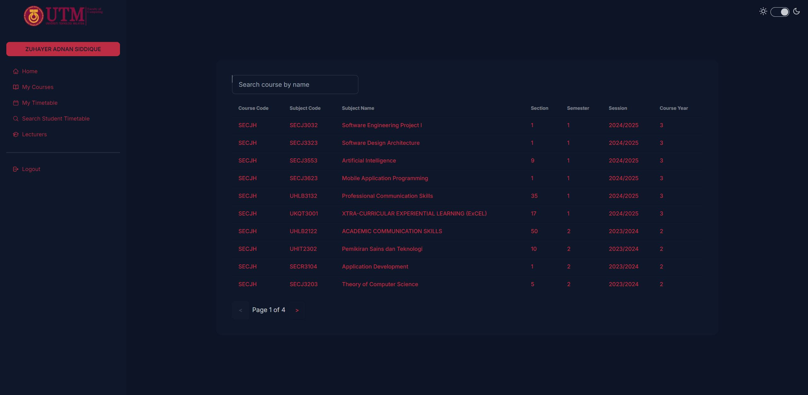

---

#### 4.3 View All Courses

- Displays a full list of available courses.

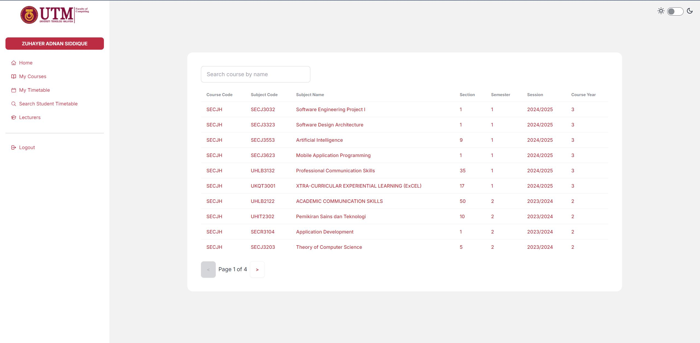

---
